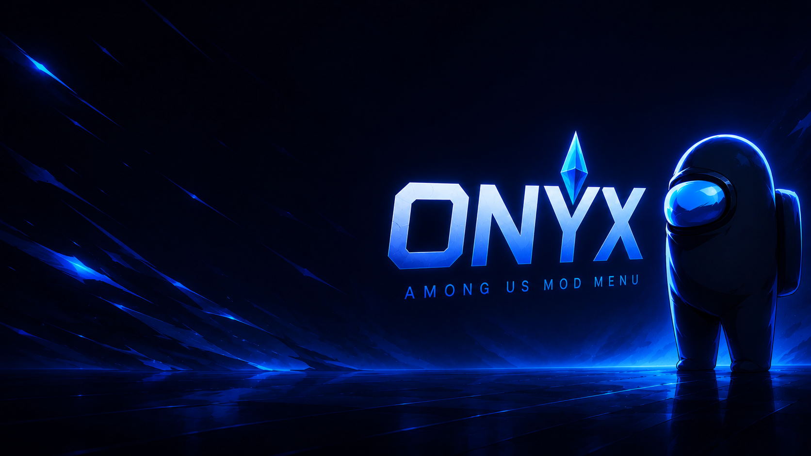
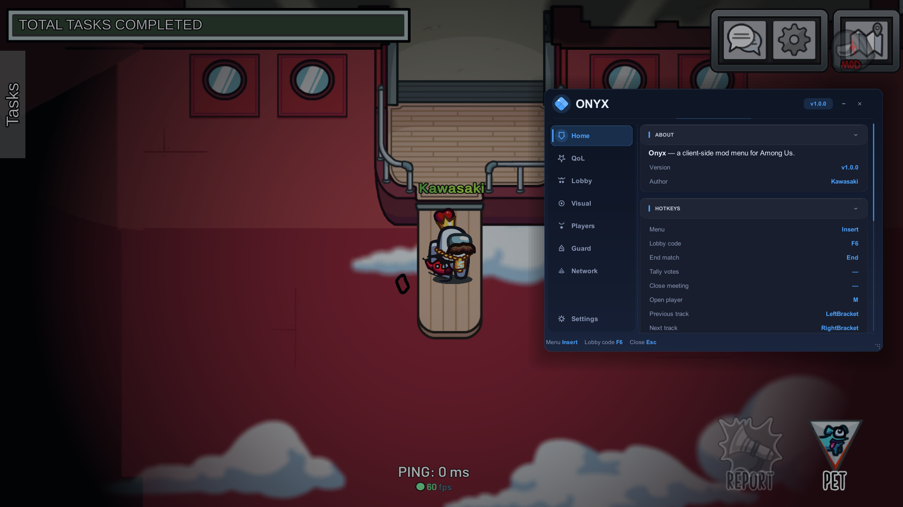
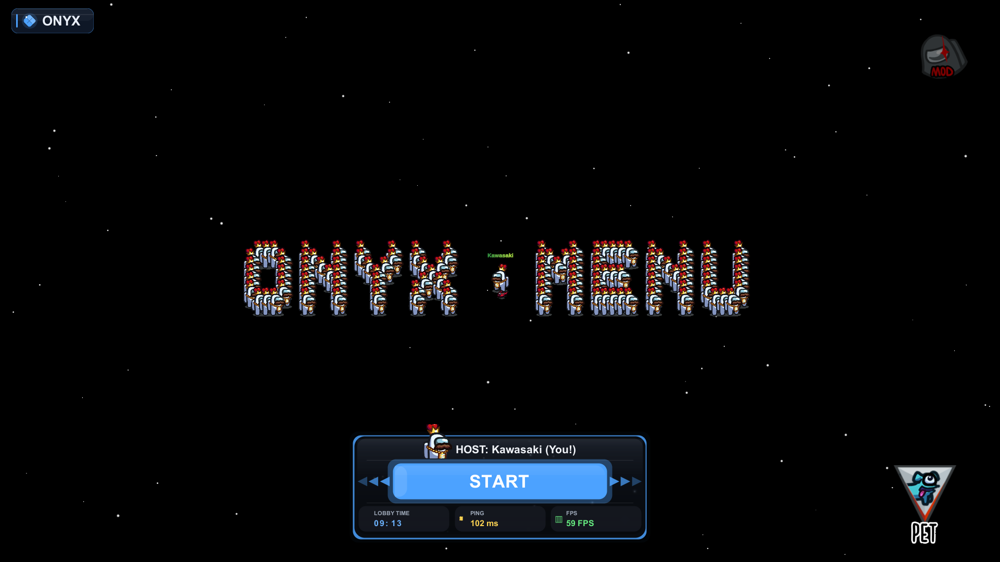
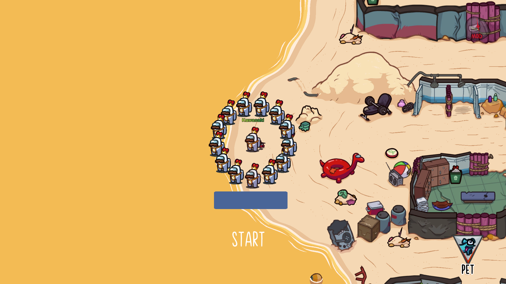
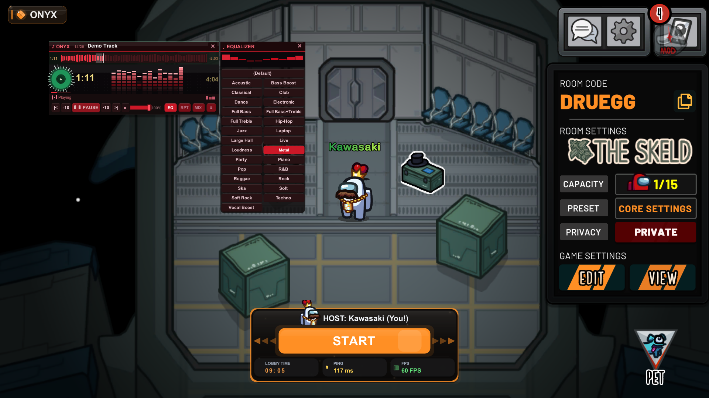

  

# 💎 Onyx

**A sleek, client-side mod menu for Among Us.**

Dark IMGUI overlay · QoL & host tools · visuals & ESP · access guard · a full built-in music player

 

  

---

## ✨ Overview

**Onyx** is a client-side mod menu built from the ground up for Among Us. Everything lives in a single dark-themed in-game overlay — no external launcher, no clutter. Toggle it with **`Insert`**, tweak what you need, and the settings persist across restarts.

- 🎨 **24 accent themes** — one sleek black UI, swap the accent color; rounded panels, smooth animations, icon sidebar
- 🌍 **Bilingual** — Russian / English, switchable in-game
- 🔒 **Client-side** — most features affect only your client
- 🧩 **Modular** — every feature is a toggle; enable only what you want

---

### ⭐ Enjoying Onyx?

If this mod makes your games better, **give it a star** — it helps others find the project and keeps development going!

---

## 💬 Community

**Joining the Discord is recommended** — it's the best place for support, release updates, bug reports and feature requests.

---

## 📜 Releases

  

**[⬇️ Download the latest release](https://github.com/Kawas-set1/OnyxMenu/releases/latest)** &nbsp;·&nbsp; **[📜 View all versions](https://github.com/Kawas-set1/OnyxMenu/releases)**

---

## 📸 Screenshots

---

## 🧰 All features

<b>⚡ Quality of Life</b>

- FPS counter & lobby timer (in the ping tracker)
- Pop-up notifications (toasts)
- FPS lock / custom cap · HUD scale
- One-key **lobby code copy** (`F6`)
- 🎡 **Radial menu** — hold a key for a wheel of favorite toggles
- ⭐ **Favorites + feature search** — star anything, find it instantly

<b>🏠 Lobby & Host</b>

- Custom **lobby bar** (host avatar, START, FPS/ping/time chips)
- Unlock Start · start / instant-start on `Enter`
- **Auto-host** — full state machine (min players, delays, force start, auto-return)
- Rich lobby browser (up to 24 rows: host / code / platform / age)
- No win conditions · 4 impostors · 2 seekers in Hide & Seek
- Fake map · destroy / rebuild the lobby object
- Dark lobby theme & panel animations
- **Lobby clones** — spawn, formations, text-art, shadow / guard / drift
- 👥 **Networked clones** — copies of you everyone sees, up to 100, formations, text-art *(others see real positions after they rejoin)*

<b>👁 Visuals & ESP</b>

- Unlock cosmetics · hide cosmetics in match · duplicate colors
- Free WASD camera · wheel zoom · no-clip
- Tracers to players / bodies · kill-cooldown ESP
- Skip Shhh / role reveal / kill animations
- Favorite outfits · hide MOD stamp
- 🎭 **Reveal shapeshifter** — true name above the disguise
- 🧪 **Fake tasks** — fake scan / "cameras in use"
- 👻 **Invisibility** — vanish on a hotkey

<b>🗺️ Radar & Vision</b>

- **Minimap radar** — dots, trails, bodies · **drag, resize & opacity** · click-to-teleport
- **ESP boxes** through walls (name + distance)
- See players **in vents** · **ghosts** while alive
- **De-anonymize votes** — who voted for whom (even anonymous)

<b>🧑 Players</b>

- Reveal all roles · info above names (level / platform)
- Show meeting votes · in-match kick / ban (host)
- **Join detect** — platform, level & raw name on join
- Body modes: Horse / Seeker / Long / Long Horse
- Mouse teleport / select · ghost after start
- Colored name

<b>💬 Chat</b>

- **Chat commands** — `/kick` `/ban` `/mute` `/color` `/role` `/start` `/end` `/meeting` `/close` `/fix`
- Send / spam messages straight from the menu

<b>🎵 Music Player</b>

- Opens with **`M`** — plays from `plugins/Onyx/Music/`
- Full DSP chain: 10-band EQ (28 presets), stereo widening, bass, loudness, de-esser, crossfade, crossfeed, saturation, limiter
- Real FFT spectrum & disc visualizer

<b>🤖 Dummies (AI bots)</b>

- 🧭 Walk the map · fake tasks · fix sabotages
- 🔪 Witness kills → report → chat → vote
- 🎭 Auto-**Crewmate** after spawn
- ⚙️ Formations · up to **100** · color · guard radius

> ⚠️ Local & host-only — see notes below.

<b>🥚 Fun & Pranks</b> <code>host</code>

- 🥚 **Whole lobby into eggs** in one click
- 🎭 **Morph** everyone into a chosen player
- 🌈 Rainbow · cosmetic cycle
- 🔁 Size / spin / beat-sync · reset look

<b>🛡 Guard</b>

- Ban list / whitelist by FriendCode (kick on join)
- Nick ban & name history
- Min / max **level** guard with kick or ban
- Block vote-kicks · **targeted vote-kick** (mark players / host preset)
- **Anti-ban** — drops the vent-kick crash packet off-host
- Reserve player colors (host)

<b>🌐 Network &nbsp;·&nbsp; 🔐 Privacy</b>

- Live ping / FPS / lobby status
- Spoof platform & displayed level
- Block analytics, crash & performance reporting

---

> ⚠️ **Dummies are client-side (local to you only).**
> They live on the host's machine and are meant for you alone. If **another real player joins**, the dummies **fail to load on their client** and that player gets **kicked / disconnected**.
> ➡️ Use dummies **solo** or in a lobby with **no other real players**.

> ❗ **Force yourself a role before you start.**
> When using dummies / **Force Roles**, open **Force Roles → your name → FORCE** before pressing Start. Starting **without a forced role = black screen**.

---

## ⌨️ Hotkeys

| Key | Action | | Key | Action |
|:---:|:-------|---|:---:|:-------|
| `Insert` | Open / close the menu | | `M` | Open the music player |
| `F6` | Copy the lobby code | | `[` / `]` | Previous / next track |
| `End` | End the match (host) | | `Esc` | Close the menu |

> All keys are rebindable in **Settings → Hotkeys**.

---

## 📦 Installation

> Onyx runs on **BepInEx (IL2CPP, Windows x64)**. Install BepInEx once, then drop the DLL in.

<b>🟢 Steam / Itch.io</b>

1. Download the latest **BepInEx BleedingEdge — IL2CPP, `win-x64`**.
2. Open the Among Us install folder:
   - **Steam:** Library → right-click **Among Us** → **Manage → Browse local files**.
   - **Itch.io:** itch app → **Among Us** → ⚙️ → **Manage → Show in Explorer** (or the folder you unpacked the game into).
3. Extract the **whole BepInEx zip** into that folder — next to `Among Us.exe`.
4. Launch the game once, wait for the main menu, then close it (this creates `BepInEx/plugins`).
5. Drop **`OnyxMenu.dll`** into `Among Us/BepInEx/plugins/`.
6. Launch and press **Insert**.

<b>🔵 Epic Games / Microsoft Store</b>

**Epic Games**
1. Epic Launcher → Library → **Among Us** → **⋯ → Manage** — the folder is usually:
   `C:\Program Files\Epic Games\AmongUs`
2. Then follow the **same steps 3–6** as Steam/Itch (extract BepInEx → run once → drop `OnyxMenu.dll` into `BepInEx/plugins/`).

**Microsoft Store / Xbox / Game Pass**
> ⚠️ The Store version installs into the protected `C:\Program Files\WindowsApps\` folder and runs as a **UWP** app, so standard BepInEx injection **does not work out of the box**. Modding it needs extra steps (taking ownership of `WindowsApps` / a UWP loader) and is fragile.
>
> **Recommended:** use the **Steam, Epic, or Itch.io** version for modding.

> First launch generates `BepInEx/config/onyx.mod.cfg`. Delete it to reset all settings.
> Keep only **one** `Onyx*.dll` in `plugins/` — remove old copies so it isn't loaded twice.

---

### 🎵 Adding music
Drop `.mp3` / `.wav` / `.ogg` / `.flac` files into `Among Us/BepInEx/plugins/Onyx/Music/`, then open the player with **`M`**.

---

## ⚠️ Disclaimer

Onyx is provided **for educational and personal use**. It is a client-side tool — you are responsible for how you use it. Some host / network features may trigger anti-cheat on **official servers**. For the best experience, disable or remove other mods before launching to avoid crashes and conflicts.

> ⚠️ **Use at your own risk.** Using this mod can violate the Among Us Terms of Service and may lead to punitive action, including **temporary or permanent bans**. The creator is **not responsible** for any consequences you may face from using it.

**Intended use.** Onyx is not meant to disrupt Innersloth's services, the availability or integrity of the game, or other players' normal experience. It is best used in **private lobbies** and with friends who consent to a modded session. Do **not** use it to grief public games, bypass protections, or gain an unfair advantage where modding is prohibited. Any misuse is solely the responsibility of the user.

**No warranty.** The software is provided **"as is"**, without warranty of any kind. It may contain bugs, break with game updates, or cause crashes. You install and run it entirely at your own discretion.

> **This mod is not affiliated with Among Us or Innersloth LLC, and the content contained therein is not endorsed or otherwise sponsored by Innersloth LLC. Portions of the materials contained herein are property of Innersloth LLC. © Innersloth LLC.**

---

## 📄 License

Released under the **[GNU GPL v3.0](LICENSE)**. You are free to use, study, share and modify Onyx, provided derivative works remain under the same license.

---

Made with 🖤 by **Kawasaki**

[**Join the Discord →**](https://discord.gg/cP4MrVUfM7)

